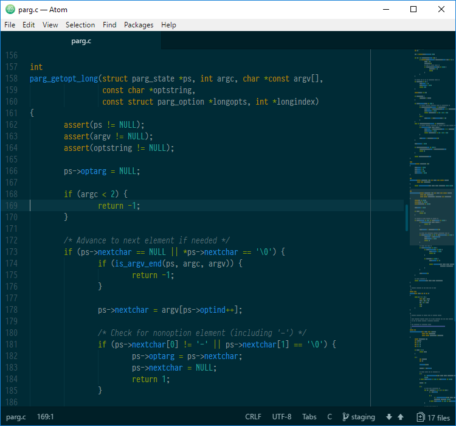

# Solarized Minimal Dark for Atom

[Solarized Minimal][solmin] is a syntax theme using the [Solarized][]
palette by Ethan Schoonover. One of the unique features of Solarized is that
it supports both a dark and light theme, using the same sixteen colors.

[Atom][] supports syntax highlighting based on the format and grammar used in
TextMate. This makes it possible to theme pretty much any part of a document,
but that doesn't necessarily mean you should.

Solarized Minimal attempts to create a more homogeneous and subtle use of
the Solarized palette by assigning colors primarily through the root groups
described in the [TextMate documentation][grammar].

[solmin]: https://jibsen.github.io/solarized-minimal/
[Solarized]: http://ethanschoonover.com/solarized
[Atom]: https://atom.io/
[grammar]: http://manual.macromates.com/en/language_grammars.html

## Usage

Open up the Settings view `Ctrl+,` choose the Install tab, and make sure
the "Themes" toggle next to the search box is selected. Search for
"solarized-minimal", and install the dark and light themes.

Now go to the Themes tab, and choose either theme from the Syntax Theme
dropdown.
